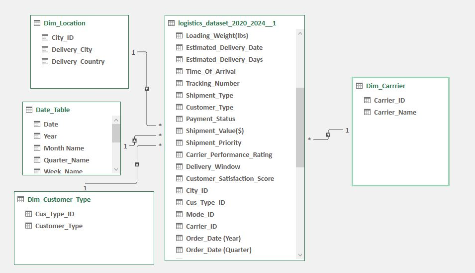
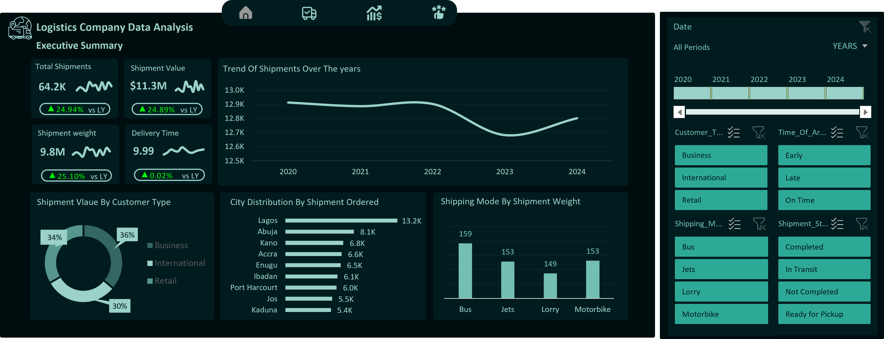
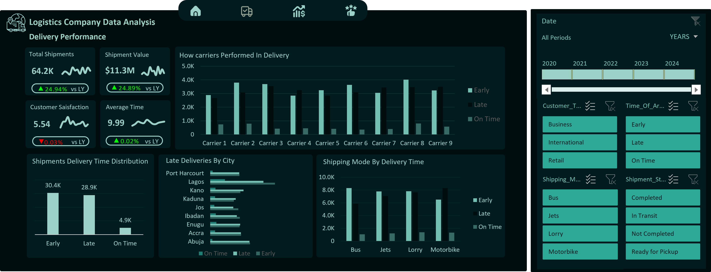
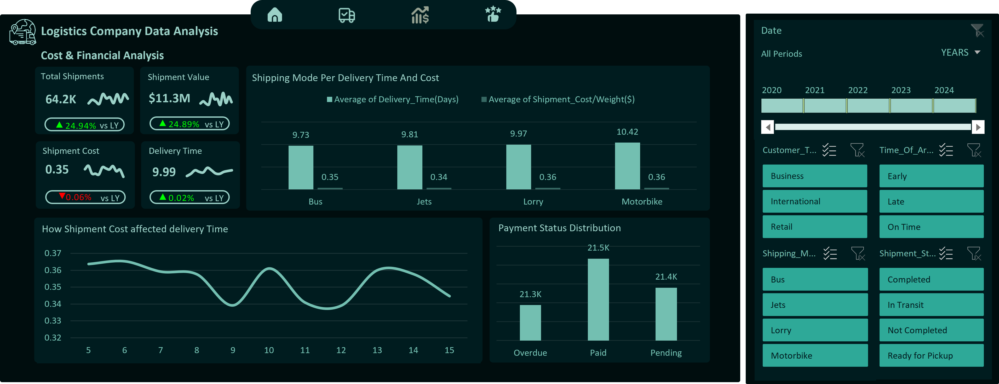
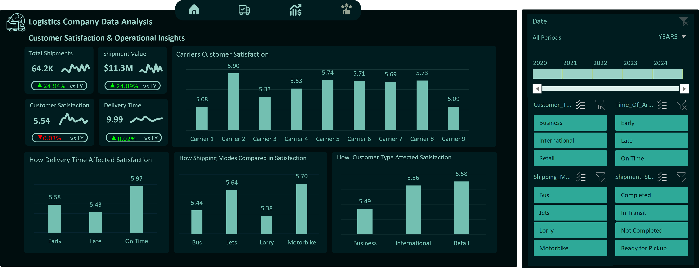

# Logistics-Company-Data-Analysis-With-Excel
The logistics industry is vital for efficient goods movement but often faces challenges like high costs, delays, and poor route management. With the rise of data-driven decision-making, logistics data analysis helps organizations identify inefficiencies, improve delivery performance, and reduce expenses. This project focuses on analyzing logistics data to uncover patterns, evaluate performance metrics such as delivery time and cost, and provide insights to improve operational efficiency and customer satisfaction.
#  Problem Statement
Many logistics operations suffer from high transportation costs, late deliveries, and inefficient route planning due to poor data utilization. The problem is the lack of proper analysis of logistics data to understand performance drivers and optimize operations. This project aims to analyze logistics data to identify key factors affecting cost and delivery efficiency, highlight underperforming areas, and recommend data-based strategies for improvement.
# Skils Demonstrated
- Data Cleaning
- Data Manipulation
- Data Modelling
- Excel Formulars, formulars, Measures, KPIs
- Pivot Tables
- Data Visualization
# Data Sourcing/Description
- It contained 24 colmuns and 64,000 worth of data
- The colmuns are - Shipment_ID, Shipment_Status, Order_Date, Delivery_Date, Shipping_Mode, Carrier_Name, Shipment_Weight(lbs), Delivery_Time(Days), Delivery_City, Delivery_Country, Shipment_Cost/Weight, Loading_Time(hrs), Loading_Weight(lbs), Estimated_Delivery_Date, Estimated_Delivery_Days, Tracking_Number, Shipment_Type, Customer_Type, Payment_Status, Shipment_Value($), Shipment_Priority, Carrier_Performance_Rating, Delivery_Window, Customer_Satisfaction_Score.
# Data Cleaning And Transformation
- Standardized Column names
- Created a date table
- Created 3 dimensions table namely 
- Dim_Locaton – For Each city and the country it is
- Dim_Carirer_name – For each Carriers
- Dim_Customer_Type -  For Each type of customer
- Created a primary key column foe each dimensions table and foreign key colmns in the f  acts table and connected each dimension to the facts table with theor corresponding primary and foreign key
- Created a time_OF_arrival column- it contains Early/late/on time values according to the order date and delivery date.
- Created Measure – Total shipments, total shipment value, total shipment weight, average delivery time, customer satisfaction, shipment cost, Their PY values and Dynamic YOY values of each KPIs
# Data Model
This is the data Model I created 
# Analysis/Visualization
## Key performance Indicators (KPIs)
- Total Shipments: 64.2k
- Total Shipments Value: $11.3M
- Total Shpiments Weight: 9.8M
- Average Customer satisfaction: 5.54
- Average Delivery Time(Days): 9.99
---
## Executive Summary

- Trend Of Shipment Over The years\
  - 2020 had highest number of shipments, it reduced slightly in 2021 and went up again in 2022, it then hit the lowest number in 2023 and picked up again in 2024.
- Shipping Mode by Weight - Using average weight carried by each mode
  - Buses carried the weightiest shipments with an average value of 159 pounds
  - Followed by motorbike and jets with an average of 153 pounds
  - Lorries carried lower weight shipments with average of 149 pounds.
- Shipment By City
  - Lagos, Nigeria had the highest number of shipments 13.3k shipments
  - Followed after a big margin by Abuja with 8.1k shipments
  - Kano came next with 6.9k shipments
  - Accra from Ghana came next with 6.6k Shipments
  - then others followed each other closely.
- How Customer Type Contributed to Shipment Value
  - Business Customer Types contributed most to shipment value taking 36% of the total Value ordered 
  - Reatil Customers came next taking 34% of the total.
  - International contributed the least with 30% of total value.
## Delivery Performance

- Shipments By Time of arrival
  - Shipments that arrived early (before estimated delivery time) are the most with a number of 30.4k shipments
  - Late shipments (came after estimated delivery time) come after with a very close number of 28.9k shipments.
  - On Time deliveries (on estimated delivery date) are the least with a little number of 4.9k shipments.
- Carriers Performance In deliveries
  - Carrier 1,2,3,5,6,8 had more early deliveries than late deliveries even though some of them differences was not that much
  - Carrier 4,7,9 had more late deliveries than early deliveries
  - The most efficient Is carrier 2 – Had the biggest difference between late and early deliveries, it also had the second highest on time deliveries
- Shipment Mode Delivery Performance
  - Buses had the highest Early deliveries and the lowest late deliveries making it the most efficient delivery Method
  - Jets had higher early deliveries than late deliveries with a good difference
  - Lorries had almost same number of Early and late deliveries, with slightly higher number of early deliveries
  - Motorbikes had the most late deliveries and had the lowest early deliveries, though with a number of time deliveries – It is still qualified as the worst performing shipping mode in deliveries
- Cities With The most late deliveries
  - Abuja, Lagos, Jos, Ibadan and Port hacorth had more early deliveries than late deliveries
  - Kano, Kaduna, Enugu and Accra had more late deliveries than early deliveries
  - Lagos had the most difference between early and late deliveries.
## Cost And Financial Analysis

- Payment status Distribution
  - Paid shipments are the most with 21.5k shipments
  - Pending Payments followed closely with 21.k shipments
  - Overdue came least but closely with 31.3k shipments
- Relationship of Shipment Cost with delivery Time
  - High Cost does not translate to quick deliveries
  - There is nee dof further investigation on this
## Customer Satisfaction

- Customer satisfaction By Time Of Arrival
  - On Time Deliveries had higher customer satisfaction 5.97
  - Early deliveries came next with 5.58
  - Late deliveries had least customer satisfaction with 5.43
- Customer Satisfaction By Shipping Mode  
  - Motorbikes had the highest rating with 5.70
  - Jets came next with 5.64
  - Buses came next with 5.44 rating
  - Lorry had the least rating with 5.38
- How customer Type Contributed to satisfaction
  - Retail customers had highest satisfaction with 5.58 rating
  - International Customers came next with 5.56 rating
  - Business Customers had the lowest satisfaction score with 5.49 rating
- Customer satisfaction By carriers
  - Carrier 2 had the highest satisfaction score with 5.9 rating 
  - Carrier 5 came next with 5.78 rating
  - Followed by cariirer eight with 5.8 rating
  - Others followed each other with little differences
  - Carrier 1 had the least customer satisfaction score with 5.08 average rating.

# Recommendations
## Operational Efficiency
- Balance Shipment Loads Across Cities:
  - Lagos handles far more shipments than any other city, which may cause strain on resources. Distribute shipments more evenly across nearby hubs or improve infrastructure in Lagos to handle the heavy traffic efficiently.
- Optimize Use of Shipping Modes:
  - Since buses and motorbikes carry heavier shipments on average, the company should review if this aligns with cost and delivery time goals. Lorries carry lighter shipments and may not be used efficiently, consider reviewing their role or combining smaller shipments to maximize capacity.
- Focus on Growth Regions:
  - Abuja, Kano, and Accra show high shipment numbers. Target marketing and service expansion in these areas to strengthen market share and boost overall volume.
## Delivery Optimization
- Prioritize Underperforming Carriers
  - Carriers 4, 7, and 9 have more late deliveries. They need training, better monitoring, or operational review to identify causes of delay (e.g., poor route planning or vehicle condition).
- Recognize and Support Efficient Carriers
  - Carrier 2 is performing best in both delivery time and customer satisfaction. Use its best practices (like scheduling or communication style) as a model for other carriers.
- Improve Motorbike Delivery Management:
  - Motorbikes have the most late deliveries, investigate possible reasons like small capacity, weather impact, or route planning. Limit their use to short, low-weight, urban deliveries.
- City-Based Route Optimization:
  - Cities like Kano, Kaduna, Enugu, and Accra have more late deliveries. Introduce better route optimization tools and track travel time trends to improve delivery punctuality in these locations.
## Financial Management
- Reduce Payment Delays
  - The number of pending and overdue payments is high. Strengthen payment follow-up processes, offer incentives for early payments, and send automated reminders to customers.
- Review Cost vs. Delivery Time
  - Since higher shipping cost doesn’t guarantee faster delivery, investigate what drives the cost. This could expose inefficiencies in carrier pricing, fuel usage, or handling charges. Adjust pricing models to reflect actual service value.
- Data-Driven Budget Allocation
  - Allocate more funds or resources to routes and carriers that consistently show better performance and satisfaction rather than spreading resources evenly.
## Customer Experience
- Focus on On-Time Deliveries
  - Even though early deliveries are common, customers are most satisfied with on-time deliveries. Train carriers to align delivery timing more accurately with promised schedules.
- Improve Business Customer Relations:
  - Business customers have the lowest satisfaction score despite being the largest revenue source. Provide dedicated support, faster response time, and tailored service options to retain them.
- Leverage Motorbike Satisfaction Insight:
  - Despite poor delivery timing, motorbikes have the highest satisfaction rating. This may be due to direct contact or faster communication with customers, study this behavior and apply similar strategies to other modes.
- Maintain and Reward Top Carriers
  - Carriers 2, 5, and 8 have high customer satisfaction. Recognize their performance and use their methods as benchmarks for others.

# Conclusion 
- This logistics data analysis provided valuable insights into shipment trends, delivery performance, financial patterns, and customer satisfaction across different years, cities, and shipping modes. The findings revealed that while overall operations remain strong, there are key areas requiring attention, particularly in balancing shipment distribution, improving carrier efficiency, and strengthening financial and customer management systems.
- The analysis showed that certain carriers and cities consistently perform better, proving that effective planning and process optimization can significantly enhance delivery outcomes. However, late deliveries in specific regions, high pending payments, and uneven cost-to-performance relationships indicate the need for better resource allocation and continuous monitoring.
- Improving on-time delivery rates, supporting underperforming carriers and enhancing service quality for business customers will not only increase efficiency but also boost customer satisfaction and loyalty. By leveraging data-driven insights, the organization can make smarter operational and strategic decisions that reduce costs, improve performance, and sustain long-term growth in a competitive logistics market.

You Can view and interact with the dashboard in the [excel file](Excel_Dataset_Dashboard.xlsx)

